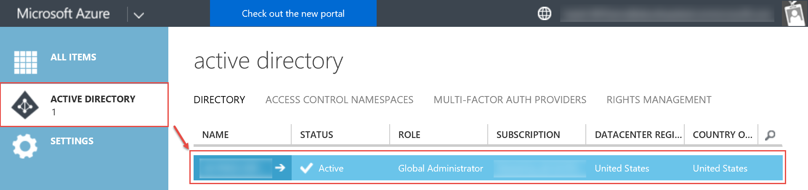
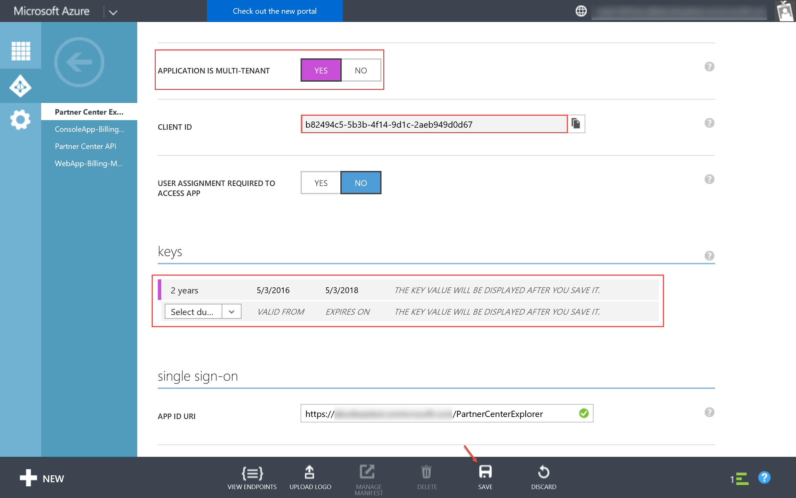
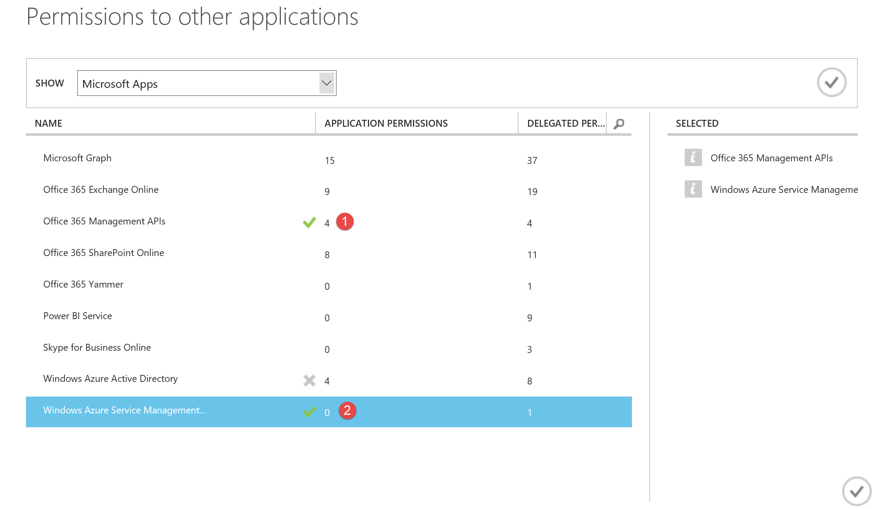
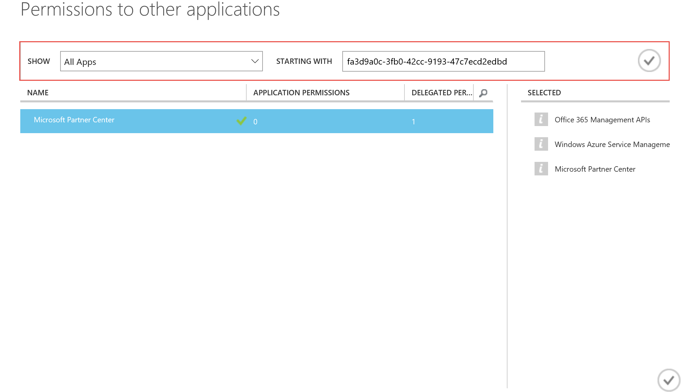
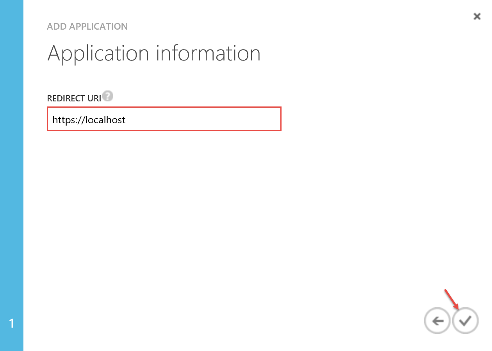
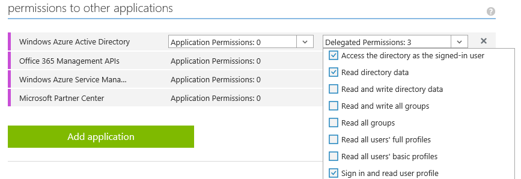
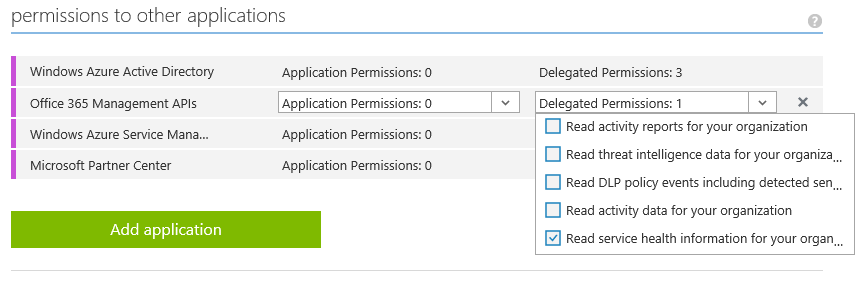
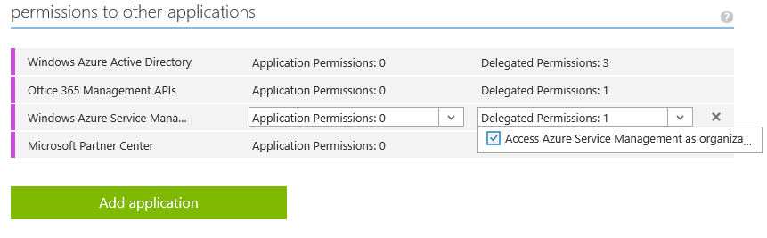
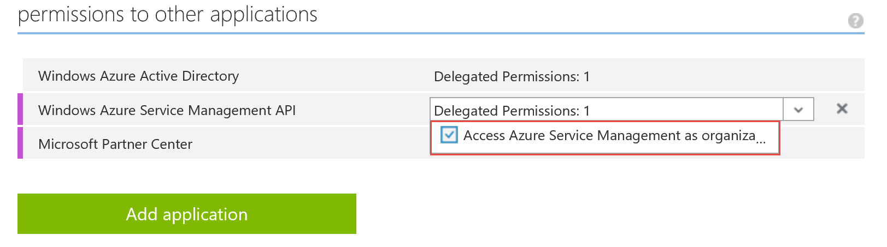
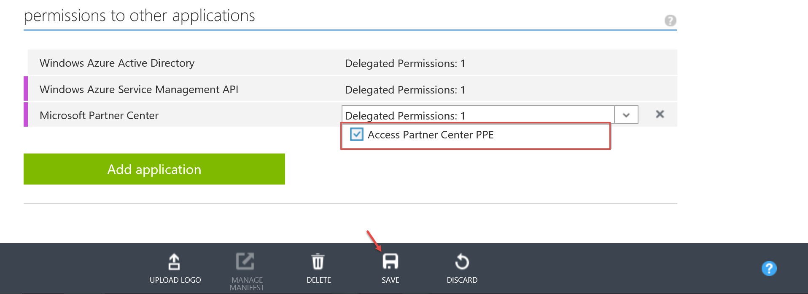

Configuring the Parnter Center Explorer sample
====================

The Parnter Center Explorer requires two Azure AD applications that have been configured for pre-consent. Perform the following 
procedures in order to create and configure the required Azure AD applications.

### Creating Web Azure AD Application
1. Login to https://manage.windowsazure.com using a global admin account associated
with your reseller tenant
2. Select the appropriate instance of Auzre AD

    
    
3. Click the *Applications* tab and then click the *Add* button 

    
    
4. Add an application as shown in the figures below

    
    
    
    
    
    
    *The value specified for the App ID URI must be a domain that associated with you reseller tenant. You can utilize the 
    onmicrosoft.com domain.*
    
5. Click the *Configure* tab and then configure the application as shown in the figures below

    
    
    *The WebApplicationId value in the web.config should be configured to the Client ID value for this application.*
    
    *Once the application is saved the key value will be displayed. The WebApplicationSecret value in the web.config
    should be configured to the key value.*
    
    
    
### Creating Native Azure AD Application
1. Login to https://manage.windowsazure.com using a global admin account associated
with your reseller tenant
2. Select the appropriate instance of Auzre AD

    
    
3. Click the *Applications* tab and then click the *Add* button 

    

4. Add an application as shown in the figures below

    

    
    
        
 
5. Click the *Configure* tab and then configure the application as shown in the figures below

    
    
    *The NativeApplicationId value in the web.config should be configured to the Client ID value for this application.*
    
    
    
    
    
    *Additional information regarding authentication for Partner Center can be found at [Partner Center authentication](https://msdn.microsoft.com/en-us/library/partnercenter/mt634709.aspx)*
    
    
    
    
    
### Configure the Newly Created Applications for Pre-consent

Both the native and web application need to be configured for pre-cosent. Follow the documentation available [here](docs/Preconsent.md) for each application. Note
you will need to replace the appId variable content prior to executing the script. Please be sure to perform this task for both applications created in the
above tasks.

### Create Service Account

App + User authentication is utilized by this sample project to interact with Azure AD Graph API, Azure Resource Manager API, and the Partner Center SDK. The
account used should have *Admin agent* rights. 

   
   
After this account has been created be sure to update the *web.config* with the user credentials. 