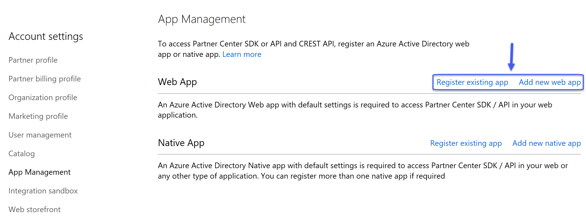
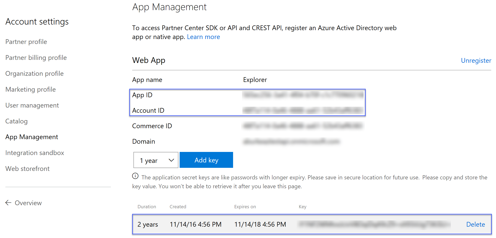

# Partner Center Explorer
Partner Center Explorer is a sample project that was developed to demonstrate what is possible in terms of integration from a partner propsective. It is not intended to function as a control panel, 
but rather as a teaching aide to help you understand how to work with the various APIs/SDKs and technologies. This sample will show you how to utilize with the Azure AD Graph API, Office 365 Service 
Communications API, Partner Center API, Power BI, Power BI Embedded, and Redis Cache to create an application that can be used to support your customers.  

### Prerequisites 
The following are _optional_ prerequisites for this sample project 

	| Prerequisites         | Purpose                                                                                                                             |
	|-----------------------|-------------------------------------------------------------------------------------------------------------------------------------|
	|  Azure Subscription   | A subscription is only required if you want to host the sample in Azure and utilize the Power BI Embedded and Redis Cache features. |

The following are _required_ prerequisites for this sample project

	| Prerequisites                           | Purpose                                                                                                           |
	|-----------------------------------------|-------------------------------------------------------------------------------------------------------------------|
	|  Azure AD global admin privileges       | Required to create the required Azure AD application utilized to obtain access tokens.                            |
	|  Partner Center admin agent privileges  | Required to perform various Partner Center operations through the Partner Center API.                             |

### Terminology
The following terms are essential to understand when working with this sample 

* **Admin on Behalf of (AOBO)** - Where an application created by the partner and registered in the partner’s Azure AD tenant can perform administrative tasks on behalf of the 
the customer. This concept leverages the app + user authentication flow.​
* **App only authentication** - An OAuth2 authentication flow where the client identifier and client secret are used to obtain a token from Azure AD for the application itself.
This is possible because the application in Azure AD has a secret, also known as a password, that is used to verify the application’s identity. ​
* **App + user authentication** - An OAuth2 authentication flow where the client identifier and user credentials are used to obtain a token from Azure AD. This type of 
authentication requires user credentials or a user assertion token. ​
* **Application permissions** - A set of permissions that are available to be assigned to an Azure AD application. Once configured these permissions will be the privileges 
that the application has been granted. In order to utilize these permissions the app only authentication flow must be used.
* **Delegated permissions** - A set permissions that are available to be delegated to a user. Once configured these permissions will be the privileges delegated to a user. In
order to utilizes these permissions the app + user authentication flow must be used.
* **Pre-consent** - A configuration for an application in Azure AD that enables the application to take advantage of the existing delegated administrative rights. This 
configuration enables an application to bypass the consent framework when accessing resources that belong to customers that have an existing relationship with the partner. 
* **Service Principal** - An object that defines the policy and permissions for an application, providing the basis for a security principal to represent the application when 
accessing resources at run-time. A service principal object is required in each tenant for which an instance of the application's usage must be represented, enabling secure 
access to resources owned by user accounts from that tenant.

### Creating Application for Partner Center API Access
To access the Partner Center API an application must be registered and configured with the partner's Azure AD tenant. Perform the following tasks to create and configure the 
application. 

1. Login into https://partnercenter.microsoft.com using credentials that have both _AdminAgent_ and _Global Admin_ privileges
2. Click _Dashboard_ -> _Account Settings_ -> _App Management_ 
3. Click on _Register existing app_ if you want to use an existing Azure AD application, or click _Add new web app_ to create a new one

	

4. Document the _App ID_ and _Account ID_ values. Also, if necessary create a key and document that value. 

	

It is important to understand that the creation and configuration of this Azure AD application can be done from the Azure Management portal. However, if you plan on utilize 
*app only* authentication to access the Partner Center API the application must be registred in Partner Center using this process. Otherwise, you will receive a HTTP 401 error
with every attempt to access the Partner Center API.

### Configuring the Application for Pre-consent
Perform the following steps to configure the application that will be used to access the Partner Center API for pre-consent 

1. Install Azure AD PowerShell Module (instruction available [here](https://msdn.microsoft.com/en-us/library/azure/jj151815.aspx#bkmk_installmodule)).
2. Update the _AppId_ and _DisplayName_ variables in the PowerShell script below
3. Execute the modified PowerShell script. When prompted for authentication specify credentials that belong to the tenant where the application was created and that have global 
admin privileges  

```powershell
Connect-MsolService

$AppId = 'INSERT-APPLICATION-ID-HERE'
$DisplayName = 'INSERT-APPLICATION-DISPLAY-NAME-HERE'

$g = Get-MsolGroup | ? {$_.DisplayName -eq 'AdminAgents'} 
$s = Get-MsolServicePrincipal | ? {$_.AppPrincipalId -eq $AppId}

if ($s -eq $null) { $s = New-MsolServicePrincipal -DisplayName $DisplayName -AppPrincipalId $AppId }
Add-MsolGroupMember -GroupObjectId $g.ObjectId -GroupMemberType ServicePrincipal -GroupMemberObjectId $s.ObjectId
```

## Code of Conduct 
This project has adopted the [Microsoft Open Source Code of Conduct](https://opensource.microsoft.com/codeofconduct/). For more 
information see the [Code of Conduct FAQ](https://opensource.microsoft.com/codeofconduct/faq/) or contact 
[opencode@microsoft.com](mailto:opencode@microsoft.com) with any additional questions or comments.

## License
Copyright (c) Microsoft Corporation. All rights reserved.

Licensed under the [MIT](LICENSE) License.