This project has adopted the [Microsoft Open Source Code of Conduct](https://opensource.microsoft.com/codeofconduct/). For more 
information see the [Code of Conduct FAQ](https://opensource.microsoft.com/codeofconduct/faq/) or contact 
[opencode@microsoft.com](mailto:opencode@microsoft.com) with any additional questions or comments.

The purpose of this sample project is to provide sample code to show partners how to
leverage the following APIs

* Azure AD Graph API 
* Azure Resource Manager API
* Office 365 Service Communications API
* Partner Center API
* Power BI

Also, it shows how to implement authentication using Azure AD, which is complaint with the Cloud Solution Provider 
Identity guidance. Follow the procedures below to properly configure this sample. 

Configuring the Partner Center Explorer sample
====================

The Partner Center Explorer requires an Azure AD applications that has been configured for pre-consent. Perform the following 
procedures in order to create and configure the required Azure AD application.

### Creating Azure Active Directory Application
1. Login to https://manage.windowsazure.com using a global admin account associated
with your reseller tenant
2. Select the appropriate instance of Azure AD

	
	
3. Click the *Applications* tab and then click the *Add* button 

	
	
4. Add an application as shown in the figures below

	
	
	
	
	
	
	*The value specified for the App ID URI must be a domain that associated with your reseller tenant. You can utilize the 
	onmicrosoft.com domain.*
	
5. Click the *Configure* tab and then configure the application as shown in the figures below

	
	
	*The ApplicationId value in the web.config should be configured to the Client ID value for this application.*
	
	*Once the application is saved the key value will be displayed. The ApplicationSecret value in the web.config
	should be configured to the key value.*
	
	Add the Office 365 Management APIs and Windows Azure Service Managment API applications
	
	
	
	Also, add the *Microsoft Partner Center* application. You will have to search for the application using the
	following GUID fa3d9a0c-3fb0-42cc-9193-47c7ecd2edbd
	
	 
	
	Since Azure AD is used for authentication you must properly configure the *Reply URL* property. The value(s) 
	specified for this property are the possible address(es) where the user will be redirected after successfully 
	authenticating. If you are running this sample project from Visual Studio you can find the proper value in 
	the *Property Manager* window
	
	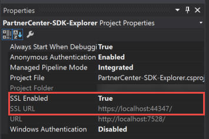
	
	The following figure shows the proper configuration for the *Reply URL* property based upon the information 
	obtained from Visual Studio
	
	  
		
	Configure the permissions for each of the applications added above as shown in the figures below

	 
		
	 
	
	
	
	
	
	Be sure to save in order to apply the permissions to the Partner Center Explorer application.
		
### Update the Application Manifest

This project utilizes custom roles which have to be created by modifying the manifest for the application. To 
modify the manifest perform the following tasks 

1. Download the manifest for the application 

	
	
	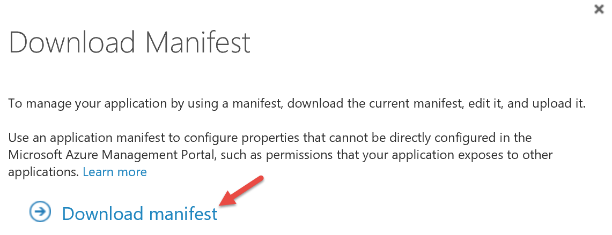
	
2. Open the JSON file in a text editor such as Visual Studio Code or Notepad 
3. Locate the appRoles section, it *should look like this "appRoles": []*
4. Modify the appRoles section as shown below

	```JSON
	"appRoles": [
		{
		"allowedMemberTypes": [
			"User"
		],
		"description": "Partner admins can manage roles and perform all operations. Members of this role should be assigned to the AdminAgents roles in Partner Center as well.",
		"displayName": "Partner Admin",
		"id": "57ae5fb9-29ef-47b5-a4f1-81bdecd019f6",
		"isEnabled": true,
		"value": "PartnerAdmin"
		},
		{
		"allowedMemberTypes": [
			"User"
		],
		"description": "Customer admins can manage resources belonging to their organizatin. Members of this role should have elevated rights within their respective tenant.",
		"displayName": "Customer Admin",
		"id": "2f30b74b-e1ee-42d4-9bcb-ce9f5d0264f0",
		"isEnabled": true,
		"value": "CustomerAdmin"
		}
	],
	``` 
5. Save the changes and upload the modified manifest

	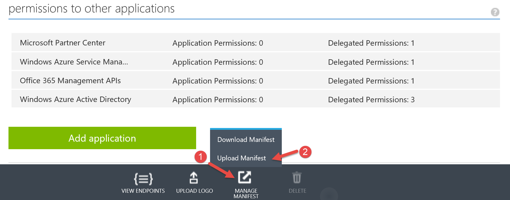

	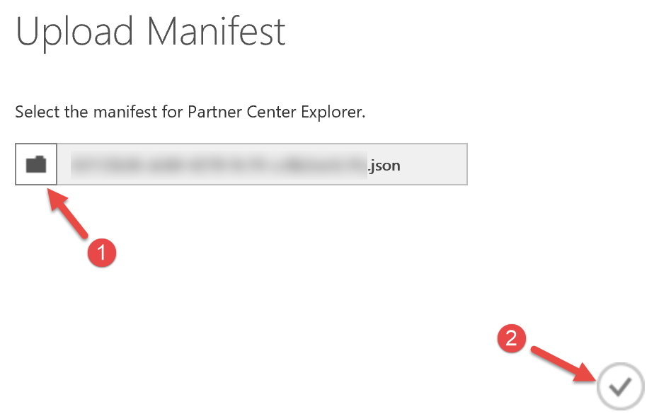

### Assign Users to Roles

Currently the only role implemented with this sample is the *PartnerAdmin* role. In order to assign a user to that role peform the following  

1. Within the application in Azure AD click the *Users* tab, select the appropriate user, and then click assign

	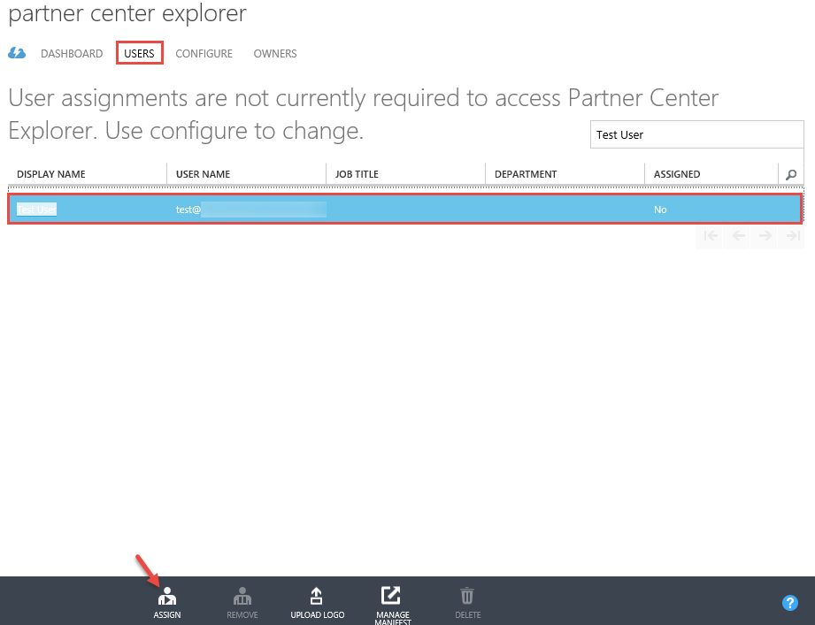
	
2. Select the desired role and then click Ok

	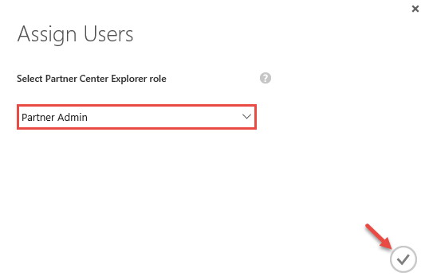

### Configure the Application for Pre-Consent

Azure AD utilizes a consent framework where an admin or user must consent to using an application before it can have access 
to their respective Azure AD tenant. This can be problematic for partners for the following reasons

1. May have several customers and it is difficult to get all customers to consent
2. Partner may need the application to execute against the customer’s Azure AD tenant right after the customer’s Azure AD 
tenant is created by the partner and before the customer is granted access

Pre-Consent is based upon the fact the partner already has delegated admin access to the customer's Azure AD tenant. Once the 
application is configured for it will apply to all customers for which the partner has delegated admin rights.  

The cmdlets below will enable the feature. You will need the 
following:

1. Install Azure AD PowerShell (instruction available [here](https://msdn.microsoft.com/en-us/library/azure/jj151815.aspx#bkmk_installmodule)).
2. Have ready the application name, if you did not use Partner Center Explorer.
3. Have ready your tenant admin credentials.

When ready, start an Azure AD PowerShell session, and run the cmdlets below. You will need to insert the application name in the third line.

```powershell
Connect-MsolService
$g = Get-MsolGroup | ? {$_.DisplayName -eq 'AdminAgents'} 
$s = Get-MsolServicePrincipal | ? {$_.AppPrincipalId -eq 'INSERT-CLIENT-ID-HERE'}
Add-MsolGroupMember -GroupObjectId $g.ObjectId -GroupMemberType ServicePrincipal -GroupMemberObjectId $s.ObjectId
```

### Power BI Configurations

This sample project utilizes [Power BI Embedded](https://azure.microsoft.com/en-us/services/power-bi-embedded/) to create interactive reports. To 
properly configure this component of the project perform the following steps

1. Create an instance of Power BI Embedded using the Azure portal

	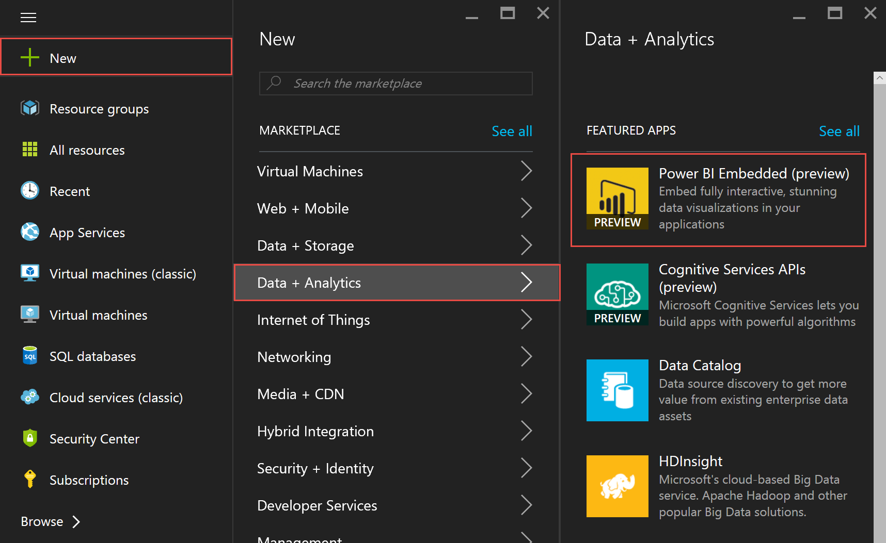

	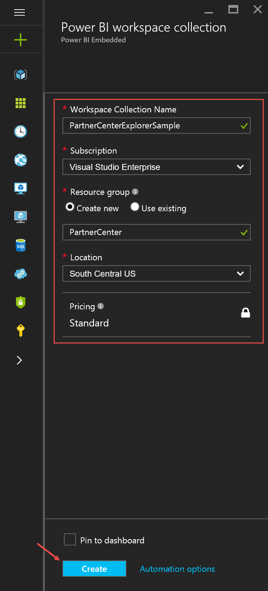

2. Download and unzip the [Power BI Embedded - Integrate a report into a web app ](https://github.com/Azure-Samples/power-bi-embedded-integrate-report-into-web-app/) sample on GitHub.

3. Open the PowerBI-embedded solution in Visual Studio 

4. Run the ProvisionSample console application

5. Provision a new workspace by select option 5 

	

	When prompted enter workspace collection name and access keys. The workspace collection is value specified in the first step and the access key can be found in the Azure portal

	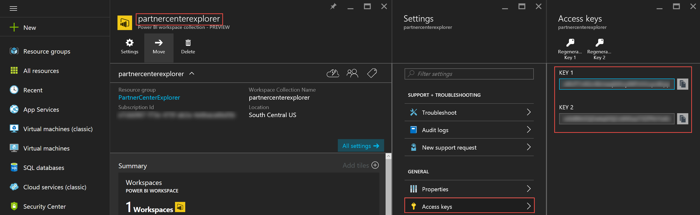

6. Copy and save the new created Workspace ID

7. Populate the PowerBI:AccessKey, PowerBI:WorkspaceCollection, and the PowerBI:WorkspaceId application settings in the web.config for the Partner-Center-SDK-Explorer project

8. Import a report (PBIX file) into the workspace by selecting option 6 

Included in this reports are two sample reports AzureInvoiceDetails.pbix and AzureUsage.pbix. These reports only have the queries defined all visualizations will have to be added after the parameters 
have been updated. To update the parameters perform the following steps

1. Open either report (AzureInvoiceDetails.pbix or AzureUsage.pbix) in Power BI Desktop

2. Click *Edit Queries* and then click *Edit Parameters*	

	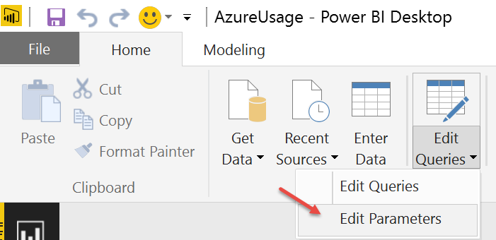
	
	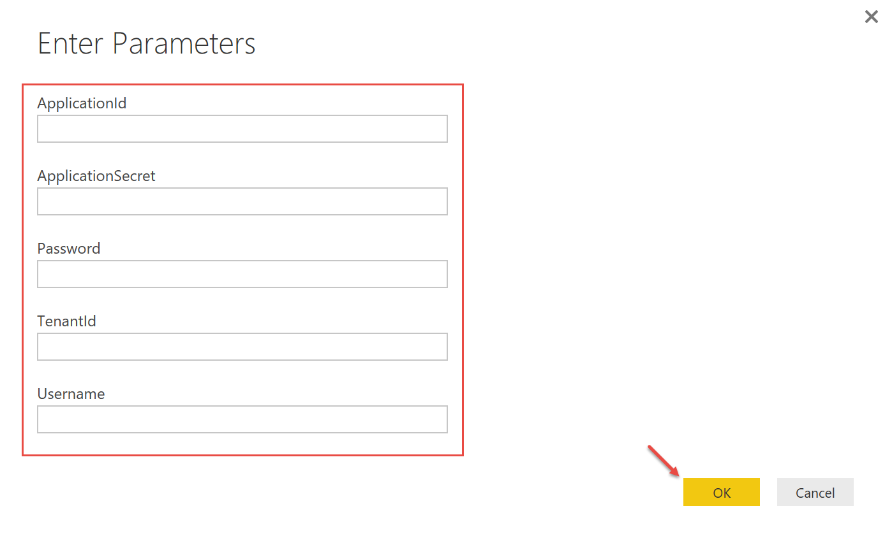

The *ApplicationId* and *ApplicationSecret* value should match what is specified in the web.config for the Partner-Center-SDK-Explorer project. The credentials specified require *AdminAgents* rights in 
order to be able to access usage details for all customers. 